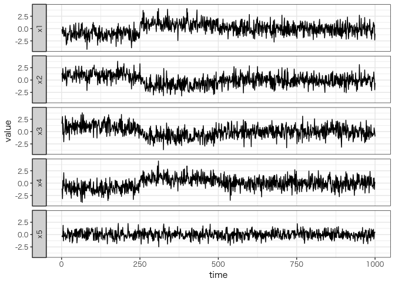

<!-- README.md is generated from README.Rmd. Please edit that file -->
Sparse Gaussian Markov Random Field Mixtures for Anomaly Detection
==================================================================

#### *Koji Makiyama (@hoxo\_m)*

Abstract
--------

1 Overview
----------

``` r
library(sGMRFmix)
set.seed(314)
train_data <- generate_train_data()
```

``` r
library(tidyverse)
df <- train_data %>% mutate(time = 1:1000) %>% gather(variable, value, -time)
ggplot(df, aes(time, value)) + geom_line() + 
  facet_wrap(~ variable, ncol = 1, strip.position = "left")
```


``` r
result <- sGMRFmix(train_data, K=7, rho=1.1, verbose = FALSE)
```

``` r
test_data <- generate_test_data()
df <- test_data %>% mutate(time = 1:1000) %>% gather(variable, value, -time)
ggplot(df, aes(time, value)) + geom_line() + 
  facet_wrap(~ variable, ncol = 1, strip.position = "left")
```



``` r
anomaly_score <- compute_anomaly_score(result, test_data)
```

``` r
df <- anomaly_score %>% mutate(time = 1:1000) %>% gather(variable, value, -time)
ggplot(df, aes(time, value)) + geom_line() + ylim(0, 30) +
  facet_wrap(~ variable, ncol = 1, strip.position = "left")
```


2 Installation
--------------

3 Details
---------

4 Related Work
--------------

5 References
------------

-   \[1\] T. Ide, A .Khandelwal, J .Kalagnanam, **Sparse Gaussian Markov
    Random Field Mixtures for Anomaly Detection**, IEEE 16th
    International Conference on Data Mining (ICDM), 2016, pp 955–960
