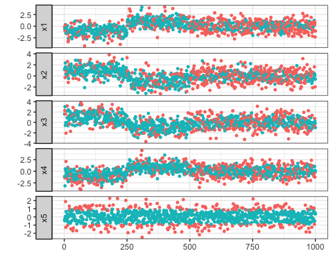

<!-- README.md is generated from README.Rmd. Please edit that file -->
Sparse Gaussian MRF Mixtures for Anomaly Detection
==================================================

#### *Koji Makiyama (@hoxo\_m)*

1 Overview
----------

The **sGMRFmix** package provides an implementation of the algorithm
presented by Ide et al. (2016). It is a novel anomaly detection method
for multivariate noisy sensor data. It can automatically handle multiple
operational modes. And it can also compute variable-wise anomaly scores.

First, we ready a multivariate training data that contains no anomaly
observations. It consists of four parts and repeats two operational
modes.

``` r
library(sGMRFmix)
set.seed(314)
train_data <- generate_train_data()
plot_multivariate_data(train_data)
```


Second, we ready a multivariate test data that contains some anomaly
values. It consists of 500 normal observations and 500 anomaly
observations. The normal part in the test data consists of two
operational modes that also have seen in the training data. Note that
the variable `x5` has no difference in the normal and anomaly part.

``` r
test_data <- generate_test_data()
plot_multivariate_data(test_data)
```


We input the training data to the `sGMRFmix()` function to learn the two
operational modes. Then we compute variable-wise anomaly scores for test
data using the result.

``` r
fit <- sGMRFmix(train_data, K = 7, rho = 1.3, verbose = FALSE)
anomaly_score <- compute_anomaly_score(fit, test_data)
plot_multivariate_data(anomaly_score) + ylim(0, 30)
```


You can see that high anomaly scores appear in the latter part of the
test data. And you can also see the variable `x5` has no high anomaly
scores.

2 Installation
--------------

You can install the package from GitHub.

``` r
install.packages("devtools") # if you have not installed "devtools" package
devtools::install_github("hoxo-m/sGMRFmix")
```

The source code for **sGMRFmix** package is available on GitHub at

<https://github.com/hoxo-m/sGMRFmix>.

3 Details
---------

### 3.1 Basics

The **sGMRFmix** package mainly provides two functions as follows:

-   `sGMRFmix` to fit the model and
-   `compute_anomaly_score` to compute anomaly scores.

``` r
library(sGMRFmix)

fit <- sGMRFmix(train_data, K, rho)
anomaly_score <- compute_anomaly_score(fit, test_data)
```

There are two hyperparameters as below.

-   `K` is a max number of mixture components.
-   `rho` is a constant that multiplies to the penalty term in the
    model.

You should set `K` a large enough number because the algorithm
identifies major dependency patterns from the data via the sparse
mixture model.

You should determine `rho` an optimal value to maximize the performance
of anomaly detection.

### 3.2 Data

To fit the model, you must prepare two kinds of data as follows:

-   Training data without anomalies to fit the model and
-   Labeled test data that contains anomalies to tuning the
    hyperparameter `rho`.

The package provides functions to generate synthetic data.

``` r
set.seed(314)
train_data <- generate_train_data()
head(train_data)
#>           x1         x2          x3         x4          x5
#> 1 -1.8269027  1.0745443  0.56970302 -1.2568921  0.08997801
#> 2 -1.6120444  0.2252822  0.74793059 -0.4788593 -1.25022520
#> 3 -0.6661666  1.2513592 -0.87397154 -0.3561145 -0.59305259
#> 4 -2.5561030 -1.1858031  0.08327536  0.6284850  0.12603220
#> 5 -1.3413068  0.7235066  1.28744741 -0.9630511 -1.10169444
#> 6 -0.2811875  1.4805043  0.33644955 -0.5148741 -0.20605220
test_data <- generate_test_data()
head(test_data)
#>           x1         x2          x3          x4          x5
#> 1 -0.1534335  1.1129516  1.61478168 -1.15048817 -0.42104579
#> 2 -0.6737145  1.3716102  2.30689870 -1.41350416 -0.26243160
#> 3 -1.0491129 -0.2908006  3.04536973 -3.15425980 -0.46513038
#> 4  0.3412411  2.3378319 -0.56224407  0.51954178  0.05482343
#> 5  0.2378417  1.6324559  1.63852619 -1.11463852  1.87995270
#> 6 -0.3792480  0.3993461 -0.03158052  0.06132161 -1.27252108
test_labels <- generate_test_labels()
head(test_labels)
#>      x1    x2    x3    x4    x5
#> 1 FALSE FALSE FALSE FALSE FALSE
#> 2 FALSE FALSE FALSE FALSE FALSE
#> 3 FALSE FALSE FALSE FALSE FALSE
#> 4 FALSE FALSE FALSE FALSE FALSE
#> 5 FALSE FALSE FALSE FALSE FALSE
#> 6 FALSE FALSE FALSE FALSE FALSE
```

Also, the package provides a function to visualize these data.

``` r
plot_multivariate_data(train_data)
```


``` r
plot_multivariate_data(test_data, label = test_labels)
```


### 3.3 Fitting the Model

The package provides the `sGMRFmix()` function to fit the model named
*Sparse Gaussian Markov Random Field Mixtures* (Ide et al., 2016). It
can automatically handle multiple operational modes. And it can also
compute variable-wise anomaly scores.

``` r
fit <- sGMRFmix(train_data, K = 7, rho = 1.3, verbose = FALSE)
fit
```

    #> 
    #> Call:
    #> sGMRFmix(x = train_data, K = 7, rho = 1.3, verbose = FALSE)
    #> 
    #> Data: 1000 x 5 
    #> Parameters:
    #>   K:    7 
    #>   rho:  1.3 
    #> Estimated:
    #>   Kest: 2 
    #>   pi:   0.502 0.498 
    #>   m, A, theta, H, mode

As the result of we set `K` to 7 and fit the model, the number of
mixtures `K-est` has been sparsely estimated 2. The weights of the
mixtures are displayed as `pi`. They are near 0.5. The result contains
other estimated parameters such as `m`, `A`, `theta`.

### 3.4 Tuning the Hyperparameter `rho`

You can fit the model without labeled data, but you should prepare a
labeled test data to tell the model what the anomalies are. To tell it,
you have no choice but to tune the hyperparameter `rho`. To avoid
overfitting, you can use cross-validation. We measure the performance of
the anomaly detection by ROC-AUC.

``` r
n_split <- 5
split_block <- sample(n_split, size = nrow(test_data), replace = TRUE)
split_test_data <- split(test_data, split_block)
split_test_labels <- split(test_labels, split_block)

rho_candidates <- 10^seq(-1, 1, length.out = 10)

library(ModelMetrics)

df <- data.frame()
for (rho in rho_candidates) {
  fit <- sGMRFmix(train_data, K = 7, rho = rho, verbose = FALSE)
  auc <- double(n_split)
  for (i in seq_len(n_split)) {
    anomaly_score <- compute_anomaly_score(fit, split_test_data[[i]])
    auc[i] <- auc(unlist(split_test_labels[[i]]), unlist(anomaly_score))
  }
  df <- rbind(df, data.frame(rho = rho, auc = auc))
}
```

``` r
library(ggplot2)
ggplot(df, aes(rho, auc)) + geom_point() +
  stat_summary(fun.y = mean, geom = "line", color = "red") + scale_x_log10()
```


``` r
library(dplyr)
df %>% group_by(rho) %>% summarise(mean_auc = mean(auc)) %>% 
  mutate(max = ifelse(max(mean_auc) == mean_auc, "***", "."))
#> # A tibble: 10 x 3
#>       rho mean_auc max  
#>     <dbl>    <dbl> <chr>
#>  1  0.100    0.587 .    
#>  2  0.167    0.633 .    
#>  3  0.278    0.630 .    
#>  4  0.464    0.620 .    
#>  5  0.774    0.633 .    
#>  6  1.29     0.663 ***  
#>  7  2.15     0.662 .    
#>  8  3.59     0.661 .    
#>  9  5.99     0.658 .    
#> 10 10.0      0.655 .
```

Optimal `rho` value that has the best performance to detect anomalies we
think is 1.29.

### 3.5 Anomaly Detection

We have obtained optimal hyperparameter `rho.` Next, let us investigate
optimal threshold value for anomaly scores. We measure the performance
of the anomaly detection by F-measure.

``` r
optimal_rho <- 1.29
fit <- sGMRFmix(train_data, K = 7, rho = optimal_rho, verbose = FALSE)

threshold_candidates <- 10^seq(-1, 1, length.out = 100)
df <- data.frame()
for (i in seq_len(n_split)) {
  anomaly_score <- compute_anomaly_score(fit, split_test_data[[i]])
  f_measure <- double(length(threshold_candidates))
  for (j in seq_along(threshold_candidates)) {
    f1 <- f1Score(unlist(split_test_labels[[i]]), unlist(anomaly_score), 
                  cutoff = threshold_candidates[j])
    f_measure[j] <- f1
  }
  df <- rbind(df, data.frame(cutoff = threshold_candidates, f_measure = f_measure))
}
```

``` r
ggplot(df, aes(cutoff, f_measure)) + geom_point() +
  stat_summary(fun.y = mean, geom = "line", color = "red") + scale_x_log10()
```


``` r
df %>% group_by(cutoff) %>% 
  summarise(mean_f_measure = mean(f_measure)) %>% 
  filter(mean_f_measure == max(mean_f_measure))
#> # A tibble: 1 x 2
#>   cutoff mean_f_measure
#>    <dbl>          <dbl>
#> 1  0.811          0.576
```

We found optimal threshold is 0.811.

We can use the value for anomaly detection.

``` r
anomaly_scores <- compute_anomaly_score(fit, test_data)
is_anomaly <- anomaly_scores > 0.811
plot_multivariate_data(test_data, label = is_anomaly)
```



### 3.6 Operational Modes

In the above, the model has identified that synthetic data consists of
two operational modes. We can see it as follows:

``` r
fit$Kest
#> [1] 2
```

We can also see the weight indicating how often these modes appear.

``` r
fit$pi
#> [1] 0.5020797 0.4979203
```

Furthermore, we can also see the structure of each mode. `fit$mode` is
the assigned mode to each observation in the training data.

``` r
head(fit$mode, 10)
#>  [1] 2 1 1 1 1 1 1 2 1 1
plot_multivariate_data(train_data, label = fit$mode)
```


Using this, we can show the correlation structures for each mode.

``` r
inds_mode1 <- c(1:250, 501:750)
true_mode1_values <- train_data[inds_mode1, ]
estimated_mode1_values <- train_data[fit$mode == 1, ]

pairs(true_mode1_values, main="True Mode 1 Structure")
pairs(estimated_mode1_values, main="Estimated Mode 1 Structure")
```


``` r
inds_mode2 <- c(251:500, 751:1000)
true_mode2_values <- train_data[inds_mode2, ]
estimated_mode2_values <- train_data[fit$mode == 2, ]

pairs(true_mode2_values, main="True Mode 2 Structure")
pairs(estimated_mode2_values, main="Estimated Mode 2 Structure")
```


In reality, true structures are unknown. We should check estimated
structures and decide whether it is reasonable.

References
----------

-   T. Ide, A .Khandelwal, J .Kalagnanam, **Sparse Gaussian Markov
    Random Field Mixtures for Anomaly Detection**, IEEE 16th
    International Conference on Data Mining (ICDM), 2016, pp 955–960
