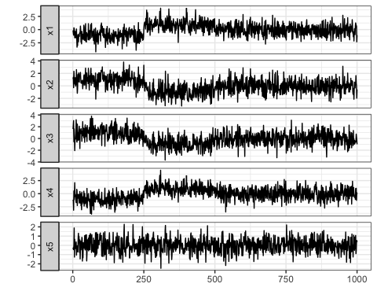
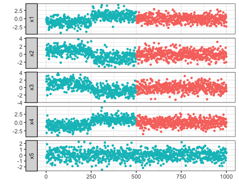
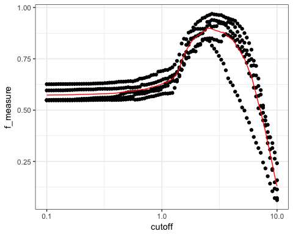
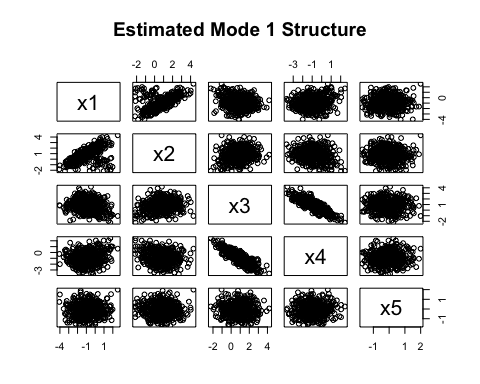

<!-- README.md is generated from README.Rmd. Please edit that file -->
Sparse Gaussian MRF Mixtures for Anomaly Detection
==================================================

#### *Koji Makiyama (@hoxo\_m)*

[](https://travis-ci.org/hoxo-m/sGMRFmix)
[](https://cran.r-project.org/package=sGMRFmix)
[](http://cranlogs.r-pkg.org/badges/sGMRFmix)
[](https://coveralls.io/r/hoxo-m/sGMRFmix?branch=master)

1 Overview
----------

The **sGMRFmix** package provides an implementation of the algorithm
presented by Ide et al. (2016). It is a novel anomaly detection method
for multivariate noisy sensor data. It can automatically handle multiple
operational modes. And it can also compute variable-wise anomaly scores.

First, we prepare a multivariate training data that contains no anomaly
observations. Here we generate a data that consists of four parts and
repeats two operational modes.

``` r
library(sGMRFmix)
set.seed(314)
train_data <- generate_train_data()
plot_multivariate_data(train_data)
```


Second, we prepare a multivariate test data that contains some anomaly
values. Here we generate a data that consists of 500 normal observations
and 500 anomaly observations. The normal part in the test data consists
of two operational modes that also have seen in the training data. Note
that the variable `x5` has no difference in the normal and anomaly part.

``` r
test_data <- generate_test_data()
plot_multivariate_data(test_data)
```



We input the training data to the `sGMRFmix()` function to learn the two
operational modes. Then we compute variable-wise anomaly scores for test
data using the result.

``` r
fit <- sGMRFmix(train_data, K = 7, rho = 0.8, verbose = FALSE)
anomaly_score <- compute_anomaly_score(fit, test_data)
plot_multivariate_data(anomaly_score, fix_scale = TRUE) + ylim(NA, 50)
```


You can see that high anomaly scores appear in the latter part of the
test data. And you can also see the variable `x5` has no high anomaly
scores.

2 Installation
--------------

You can install the **sGMRFmix** package from CRAN.

``` r
install.packages("sGMRFmix")
```

You can also install the package from GitHub.

``` r
install.packages("devtools") # if you have not installed "devtools" package
devtools::install_github("hoxo-m/sGMRFmix")
```

The source code for **sGMRFmix** package is available on GitHub at

<https://github.com/hoxo-m/sGMRFmix>.

3 Details
---------

### 3.1 Basics

The **sGMRFmix** package mainly provides two functions as follows:

-   `sGMRFmix` to fit the model and
-   `compute_anomaly_score` to compute anomaly scores.

``` r
library(sGMRFmix)

fit <- sGMRFmix(train_data, K, rho)
anomaly_score <- compute_anomaly_score(fit, test_data)
```

There are two hyperparameters as below.

-   `K` is a max number of mixture components.
-   `rho` is a constant that multiplies to the penalty term in the
    model.

You only need to set `K` a large enough number because the algorithm
identifies major dependency patterns from the data via the sparse
mixture model.

On the other hand, you should determine `rho` an optimal value to
maximize the performance of anomaly detection.

### 3.2 Data

To fit the model, you must prepare two kinds of data as follows:

-   Training data without anomalies to fit the model and
-   Labeled test data that contains anomalies to tuning the
    hyperparameter `rho`.

The package provides several functions to generate synthetic data.

``` r
set.seed(314)
train_data <- generate_train_data()
head(train_data)
#>           x1         x2          x3         x4          x5
#> 1 -1.8269027  1.0745443  0.56970302 -1.2568921  0.08997801
#> 2 -1.6120444  0.2252822  0.74793059 -0.4788593 -1.25022520
#> 3 -0.6661666  1.2513592 -0.87397154 -0.3561145 -0.59305259
#> 4 -2.5561030 -1.1858031  0.08327536  0.6284850  0.12603220
#> 5 -1.3413068  0.7235066  1.28744741 -0.9630511 -1.10169444
#> 6 -0.2811875  1.4805043  0.33644955 -0.5148741 -0.20605220
test_data <- generate_test_data()
head(test_data)
#>           x1         x2          x3          x4          x5
#> 1 -0.1534335  1.1129516  1.61478168 -1.15048817 -0.42104579
#> 2 -0.6737145  1.3716102  2.30689870 -1.41350416 -0.26243160
#> 3 -1.0491129 -0.2908006  3.04536973 -3.15425980 -0.46513038
#> 4  0.3412411  2.3378319 -0.56224407  0.51954178  0.05482343
#> 5  0.2378417  1.6324559  1.63852619 -1.11463852  1.87995270
#> 6 -0.3792480  0.3993461 -0.03158052  0.06132161 -1.27252108
test_labels <- generate_test_labels()
head(test_labels)
#>      x1    x2    x3    x4    x5
#> 1 FALSE FALSE FALSE FALSE FALSE
#> 2 FALSE FALSE FALSE FALSE FALSE
#> 3 FALSE FALSE FALSE FALSE FALSE
#> 4 FALSE FALSE FALSE FALSE FALSE
#> 5 FALSE FALSE FALSE FALSE FALSE
#> 6 FALSE FALSE FALSE FALSE FALSE
```

Also, the package provides a function to visualize these data.

``` r
plot_multivariate_data(train_data)
```


``` r
plot_multivariate_data(test_data, label = test_labels)
```



### 3.3 Fitting Model

The package provides a function `sGMRFmix()` to fit the model named
*Sparse Gaussian Markov Random Field Mixtures* (Ide et al., 2016). It
can automatically handle multiple operational modes and allows to
compute variable-wise anomaly scores.

``` r
fit <- sGMRFmix(train_data, K = 7, rho = 0.8, verbose = FALSE)
fit
```

    #> 
    #> Call:
    #> sGMRFmix(x = train_data, K = 7, rho = 0.8, verbose = FALSE)
    #> 
    #> Data: 1000 x 5 
    #> Parameters:
    #>   K:    7 
    #>   rho:  0.8 
    #> Estimated:
    #>   Kest: 2 
    #>   pi:   0.502 0.498 
    #>   m, A, theta, H, mode

As the result of we set `K` to 7 and fit the model, the number of
mixtures `Kest = 2` has been obtained by the sparse estimation. The
estimated weights of the mixtures are displayed as `pi`. They are near
0.5. The result contains other estimated parameters such as `m`, `A`,
`theta`.

### 3.4 Tuning Hyperparameter `rho`

You can fit the model without labeled data, but you should prepare a
labeled test data to tell the model what the anomalies are. To do it,
you have no choice but to tune the hyperparameter `rho`. To avoid
overfitting, you can use cross-validation. We measure the performance of
the anomaly detection by ROC-AUC.

``` r
n_split <- 5
split_block <- sample(n_split, size = nrow(test_data), replace = TRUE)
split_test_data <- split(test_data, split_block)
split_test_labels <- split(test_labels, split_block)

rho_candidates <- 10^seq(-1, 1, length.out = 10)

library(ModelMetrics)

df <- data.frame()
for (rho in rho_candidates) {
  fit <- sGMRFmix(train_data, K = 7, rho = rho, verbose = FALSE)
  auc <- double(n_split)
  for (i in seq_len(n_split)) {
    anomaly_score <- compute_anomaly_score(fit, split_test_data[[i]])
    auc[i] <- auc(unlist(split_test_labels[[i]]), unlist(anomaly_score))
  }
  df <- rbind(df, data.frame(rho = rho, auc = auc))
}
```

``` r
library(ggplot2)
ggplot(df, aes(rho, auc)) + geom_point() +
  stat_summary(fun.y = mean, geom = "line", color = "red") + scale_x_log10()
```


``` r
library(dplyr)
df %>% group_by(rho) %>% summarise(mean_auc = mean(auc)) %>% 
  mutate(max = ifelse(max(mean_auc) == mean_auc, "***", "."))
#> # A tibble: 10 x 3
#>       rho mean_auc max  
#>     <dbl>    <dbl> <chr>
#>  1  0.100    0.577 .    
#>  2  0.167    0.580 .    
#>  3  0.278    0.560 .    
#>  4  0.464    0.569 .    
#>  5  0.774    0.659 ***  
#>  6  1.29     0.656 .    
#>  7  2.15     0.652 .    
#>  8  3.59     0.646 .    
#>  9  5.99     0.635 .    
#> 10 10.0      0.616 .
```

Optimal `rho` value that has the best performance to detect the
anomalies is 0.774.

### 3.5 Anomaly Detection

We have obtained optimal hyperparameter `rho.` Next, let us investigate
optimal threshold value for anomaly scores. We measure the performance
of the anomaly detection by F-measure.

``` r
optimal_rho <- 0.774
fit <- sGMRFmix(train_data, K = 7, rho = optimal_rho, verbose = FALSE)

threshold_candidates <- 10^seq(-1, 1, length.out = 100)
df <- data.frame()
for (i in seq_len(n_split)) {
  anomaly_score <- compute_anomaly_score(fit, split_test_data[[i]])
  f_measure <- double(length(threshold_candidates))
  for (j in seq_along(threshold_candidates)) {
    f1 <- f1Score(unlist(split_test_labels[[i]]), unlist(anomaly_score), 
                  cutoff = threshold_candidates[j])
    f_measure[j] <- f1
  }
  df <- rbind(df, data.frame(cutoff = threshold_candidates, f_measure = f_measure))
}
```

``` r
ggplot(df, aes(cutoff, f_measure)) + geom_point() +
  stat_summary(fun.y = mean, geom = "line", color = "red") + scale_x_log10()
```


``` r
df %>% group_by(cutoff) %>% 
  summarise(mean_f_measure = mean(f_measure)) %>% 
  filter(mean_f_measure == max(mean_f_measure))
#> # A tibble: 1 x 2
#>   cutoff mean_f_measure
#>    <dbl>          <dbl>
#> 1   1.71          0.577
```

We found optimal threshold is 1.71.

We can use the value for anomaly detection.

``` r
anomaly_scores <- compute_anomaly_score(fit, test_data)
is_anomaly <- anomaly_scores > 1.71
plot_multivariate_data(test_data, label = is_anomaly)
```


### 3.6 Moving Average of Anomaly Scores

In the above example, you might think the F-measure is low. There is
another way if you are interested in whether anomalies occur densely
rather than individual one.

You can calculate moving average (or called rolling mean) for the
anomaly scores by passing window size.

``` r
window_size <- 20

df <- data.frame()
for (i in seq_len(n_split)) {
  anomaly_score <- compute_anomaly_score(fit, split_test_data[[i]], window_size)
  f_measure <- double(length(threshold_candidates))
  for (j in seq_along(threshold_candidates)) {
    f1 <- f1Score(unlist(split_test_labels[[i]]), unlist(anomaly_score), 
                  cutoff = threshold_candidates[j])
    f_measure[j] <- f1
  }
  df <- rbind(df, data.frame(cutoff = threshold_candidates, f_measure = f_measure))
}
```

``` r
ggplot(df, aes(cutoff, f_measure)) + geom_point() +
  stat_summary(fun.y = mean, geom = "line", color = "red") + scale_x_log10()
```



``` r
df %>% group_by(cutoff) %>% 
  summarise(mean_f_measure = mean(f_measure)) %>% 
  filter(mean_f_measure == max(mean_f_measure))
#> # A tibble: 1 x 2
#>   cutoff mean_f_measure
#>    <dbl>          <dbl>
#> 1   2.60          0.899
```

``` r
anomaly_scores <- compute_anomaly_score(fit, test_data, window_size)
is_anomaly <- anomaly_scores > 2.60
plot_multivariate_data(test_data, label = is_anomaly)
```


You can see that we obtained an anomaly detector with high performance.

### 3.7 Structure of Operational Modes

In the above, the model has identified that the synthetic data consists
of two operational modes. We can see it as follows:

``` r
fit$Kest
#> [1] 2
```

We can also see the weight indicating how often these modes appear.

``` r
fit$pi
#>         1         2 
#> 0.5020808 0.4979192
```

Furthermore, we can also see the structure of each mode. `fit$mode` is
the assigned mode to each observation in the training data.

``` r
head(fit$mode, 10)
#>  [1] 2 1 1 1 1 1 1 2 1 1
plot_multivariate_data(train_data, label = fit$mode, guide_title = "Mode")
```


Using it, you can see the correlation structure for each mode.

``` r
inds_mode1 <- c(1:250, 501:750)
true_mode1_values <- train_data[inds_mode1, ]
estimated_mode1_values <- train_data[fit$mode == 1, ]

pairs(true_mode1_values, main="True Mode 1 Structure")
pairs(estimated_mode1_values, main="Estimated Mode 1 Structure")
```



``` r
inds_mode2 <- c(251:500, 751:1000)
true_mode2_values <- train_data[inds_mode2, ]
estimated_mode2_values <- train_data[fit$mode == 2, ]

pairs(true_mode2_values, main="True Mode 2 Structure")
pairs(estimated_mode2_values, main="Estimated Mode 2 Structure")
```


In reality, true structure are unknown. You should check estimated
structure and consider whether it is reasonable.

You can also see the structure of the anomaly state. To compare it with
the normal operating modes will be helpful to investigate what caused
the anomalies.

``` r
true_anomlay <- test_data[501:1000, ]
estimated_anomaly <- test_data[is_anomaly, ]

pairs(true_anomlay, main="True Anomaly Structure")
pairs(estimated_anomaly, main="Estimated Anomaly Structure")
```


Reference
---------

-   T. Ide, A .Khandelwal, J .Kalagnanam, **Sparse Gaussian Markov
    Random Field Mixtures for Anomaly Detection**, IEEE 16th
    International Conference on Data Mining (ICDM), 2016, pp 955–960
